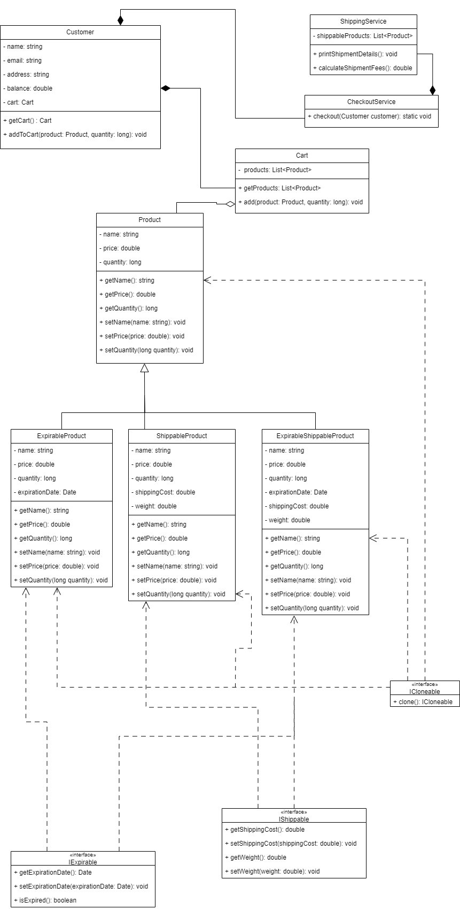

# E-Commerce System

A comprehensive Java-based e-commerce system for Fawry Rise Journey Fullstack Internship. It demonstrates object-oriented programming principles including inheritance, polymorphism, and interface implementation. The system manages different types of products, handles customer carts, and processes checkout operations with shipping calculations.

## ✨ Features

### Product Management
- **Regular Products**: Basic product functionality with name, price, and quantity
- **Expirable Products**: Products with expiration dates and automatic expiry validation
- **Shippable Products**: Products with shipping costs and weight calculations
- **Expirable Shippable Products**: Combined functionality of both expirable and shippable products

### Shopping Cart System
- Add products to cart with quantity validation
- Automatic stock management
- Expiry date validation before adding to cart
- Product cloning for cart isolation

### Checkout & Payment
- Customer balance validation
- Automatic shipping fee calculation for shippable products
- Comprehensive receipt generation
- Error handling for insufficient funds

### Shipping Management
- Weight-based shipping calculations
- Detailed shipment notices
- Support for mixed product types in shipments

## 🏗️ Architecture

The system follows a clean architecture pattern with clear separation of concerns:

- **Models**: Core business entities (`Product`, `Customer`, `Cart`)
- **Interfaces**: Contracts for specialized behaviors (`ICloneable`, `IExpirable`, `IShippable`)
- **Services**: Business logic for checkout and shipping operations

### Design Patterns Used
- **Strategy Pattern**: Different product types implement specialized interfaces
- **Template Method**: Base `Product` class with extensible behavior
- **Factory Pattern**: Product creation and cloning mechanisms

## 🚀 Getting Started

### Prerequisites
- Java 8 or higher
- Any Java IDE (IntelliJ IDEA, Eclipse, VS Code)

### Installation
1. Clone the repository:
   ```bash
   git clone https://github.com/AhmedEhab2022/e-commerce-system-Fawry-Internship.git
   cd e-commerce-system-Fawry-Internship
   ```

2. Compile the project:
   ```bash
   javac -d bin **/*.java *.java
   ```

3. Run the application:
   ```bash
   java -cp bin Main
   ```

## 💡 Usage

### Creating Products
```java
// Regular product
Product regularProduct = new Product("Regular Product", 10.0, 100);

// Expirable product
ExpirableProduct expirableProduct = new ExpirableProduct(
    "Expirable Product", 15.0, 50, 
    new Date(System.currentTimeMillis() + 86400000)
);

// Shippable product
ShippableProduct shippableProduct = new ShippableProduct(
    "Shippable Product", 50.0, 20, 2.0, 500.0
);

// Expirable and shippable product
ExpirableShippableProduct expirableShippableProduct = new ExpirableShippableProduct(
    "Expirable Shippable Product", 30.0, 10, 
    new Date(System.currentTimeMillis() + 86400000), 1.5, 300.0
);
```

### Managing Customer Cart
```java
Customer customer = new Customer("John Doe", "john@example.com", "123 Main St", 200.0);
customer.addToCart(regularProduct, 2);
customer.addToCart(expirableProduct, 1);
```

### Processing Checkout
```java
CheckoutService.checkout(customer);
```

## 📁 Project Structure

```
├── Main.java                          # Application entry point
├── README.md                          # Project documentation
├── Assets/
│   └── e-commerce-class-diagram.png   # Class diagram image
├── Interfaces/
│   ├── ICloneable.java                # Cloning contract
│   ├── IExpirable.java                # Expiration functionality
│   └── IShippable.java                # Shipping functionality
├── Models/
│   ├── Cart.java                      # Shopping cart management
│   ├── Customer.java                  # Customer entity
│   ├── ExpirableProduct.java          # Products with expiration
│   ├── ExpirableShippableProduct.java # Combined expirable + shippable
│   ├── Product.java                   # Base product class
│   └── ShippableProduct.java          # Products with shipping
└── Services/
    ├── CheckoutService.java           # Checkout processing
    └── ShippingService.java           # Shipping calculations
```

## 📊 Class Diagram



### Key Interfaces
- **ICloneable**: Provides object cloning capability
- **IExpirable**: Manages expiration dates and validation
- **IShippable**: Handles shipping costs and weight calculations

## 🔧 Error Handling

The system includes comprehensive error handling for:
- ❌ Adding expired products to cart
- ❌ Insufficient product stock
- ❌ Negative customer balance
- ❌ Empty cart checkout
- ❌ Null customer validation


## Main Class Sample
```java
public class Main {

  public static void main(String[] args) {
    // create products of different types
    Product regularProduct = new Product("Regular Product", 10.0, 100);
    ExpirableProduct expirableProduct = new ExpirableProduct("Expirable Product", 15.0, 50, new Date(System.currentTimeMillis() + 86400000)); // expires in 1 day
    ExpirableProduct expiredProduct = new ExpirableProduct("Expired Product", 20.0, 30, new Date(System.currentTimeMillis() - 86400000)); // expired yesterday
    ShippableProduct shippableProduct = new ShippableProduct("Shippable Product", 50.0, 20, 2.0, 500.0); // weight 500g
    ExpirableShippableProduct expirableShippableProduct = new ExpirableShippableProduct("Expirable Shippable Product", 25.0, 10, new Date(System.currentTimeMillis() + 86400000), 3.0, 1000.0); // expires in 1 day, weight 1000g

    // create Customer
    Customer customer = new Customer("John Doe", "J.example@gmail.com", "address", 200.0);
    customer.addToCart(regularProduct, 2);
    customer.addToCart(expirableProduct, 1);
    
    // print error for adding expired product
    customer.addToCart(expiredProduct, 1); // prints error message
    System.err.println("-------------------------------------------------");

    // add quantities more than available stock
    customer.addToCart(shippableProduct, 25); // prints error message
    System.err.println("-------------------------------------------------");
    

    // checkout with valid Customer without shippable products
    CheckoutService.checkout(customer);
    System.out.println("-------------------------------------------------");

    // Checkout with valid Customer with shippable products
    customer.addToCart(shippableProduct, 1);
    customer.addToCart(expirableShippableProduct, 1);
    CheckoutService.checkout(customer);
    System.out.println("-------------------------------------------------");


    // checkout with invalid Customer
    try {
      CheckoutService.checkout(null);
    } catch (IllegalArgumentException e) {
      System.out.println("Error: " + e.getMessage());
    }
    System.out.println("-------------------------------------------------");

    Customer customer2 = new Customer("Jane Smith", "Ja.example.com", "address2", 10);
    // Checkout with empty cart
    try {
      CheckoutService.checkout(customer2);
    } catch (IllegalStateException e) {
      System.out.println("Error: " + e.getMessage());
    }
    System.out.println("-------------------------------------------------");
    
    // Insufficient balance for checkout
    customer2.addToCart(shippableProduct, 1);
    customer2.addToCart(expirableShippableProduct, 1);
    CheckoutService.checkout(customer2);
  }
}
  ````


## Console Output

